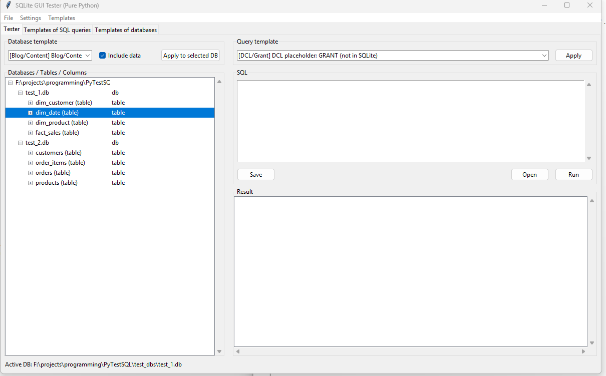

# SQLite GUI Tester

A pure-Python 3.10 GUI tool (Tkinter + SQLite) for learning, testing and exploring SQL.




## Features

* **Three main tabs**:

  1. **Tester**

     * Explore your test databases in a tree view (DB → Tables → Columns).
     * Schema templates: apply a ready-made database structure (with or without sample data).
     * Query templates: load parameterized SQL snippets into the editor.
     * Editor with *Save*, *Open*, *Run*. Results (or errors) shown in a table at the bottom.
  2. **SQL Query Templates**

     * ~1,700 prebuilt queries (DDL, DQL, DML, TCL, meta).
     * Organized in a category tree (DDL, DQL, DML, DCL, TCL).
     * Right panel shows query text and description.
  3. **Database Templates**

     * ~600 schema + data templates (from simple demo schemas to complex learning/production patterns).
     * Select a template, apply to a test DB, optionally including sample data.

* **Settings DB** (separate SQLite file) to store preferences. It is **never overwritten** by test actions.

* **Resizable UI**: tree, tables, and editor panes expand proportionally with the window.

* **Cross-platform**: only uses Python stdlib (Tkinter + sqlite3). No third-party dependencies.

* **Windows helper**: `make_shortcut.cmd` can create a desktop shortcut to launch `sql_tester.py`.

## Files

* `sql_tester.py` — the main Tkinter application.
* `sqlite_templates.json` — library of ~1,700 SQL query templates + ~600 DB schema templates.
* `make_shortcut.cmd` — optional Windows batch script to make a desktop shortcut.
* `settings.db` (auto-created) — internal app settings storage (do not edit by hand).

## Usage

1. Install Python 3.10+ with Tkinter (on Windows it’s bundled; on Linux use `sudo apt install python3-tk`).
2. Clone this repository:

   ```bash
   https://github.com/degenerator3003/sqlite-gui-tester.git

   cd sqlite-gui-tester
   ```
3. Run:

   ```bash
   python sql_tester.py
   ```
4. (Windows) double-click `make_shortcut.cmd` once to create a desktop shortcut.

## Creating a Test DB

* **New DB**: `File → New Test DB…` → name it → appears in the left tree.
* **Apply a template**: use the schema combobox at the top left of the Tester tab.
* **Write your own**: paste SQL in the editor and click *Run*.

## Importing Templates

* Use **Templates → Import from JSON…** to load `sqlite_templates.json`.
* After import, you’ll see the categories and templates appear in the Template tabs.

## License

MIT License — see [LICENSE](LICENSE).
SQLite is public domain; this project uses only Python stdlib.

---


